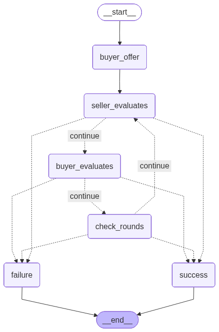
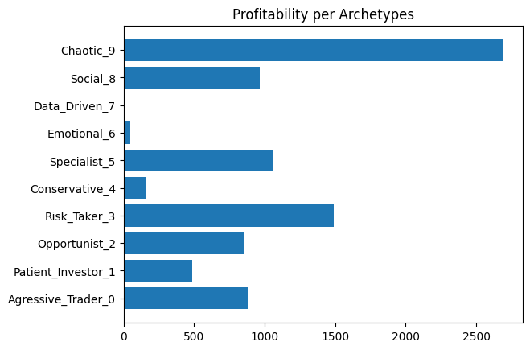
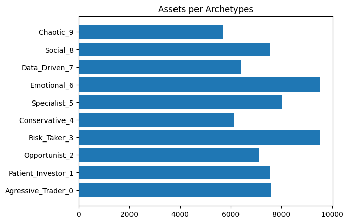
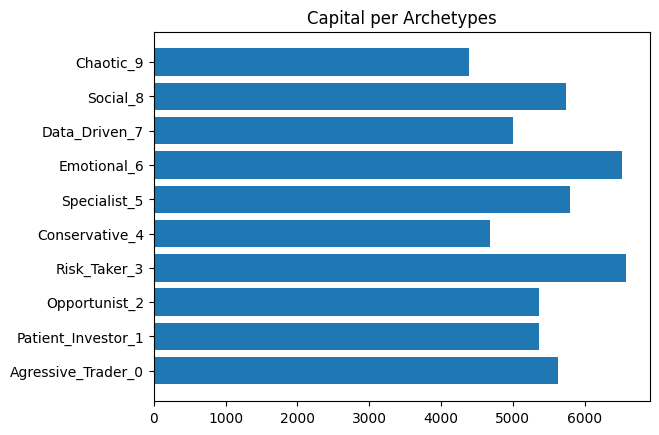

# Multi-Agent Marketplace Simulation

## Overview
Autonomous AI agents that simulate a functioning marketplace with emergent economic behaviors.

## Features
- 10 agents with distinct personalities
- Multi-round negotiations (up to 5 rounds)
- Agent memory and learning
- Complete transaction ledger
- Comprehensive analytics


## Quick Start
```bash
pip install uv
uv sync
python main.py
```

## Architecture
- LangGraph for negotiation state machines
- Gemini for agent decision-making
- Pydantic for data validation

## LangGraph Workflow



## Results

### Profitability
- Chaotic personality is the most profitable.
- Data Driven personality didn't do any negotiation
- Risky Taker is the second most profitable.



### Assets
- Risk Taker and Emotional have more assets (capital + items)
- Conservative has less assets



### Capital

- Risk Taker and Emotional have more capital




## Findings

As the simulation data is stored in a folder, several data analysis could be done based on them, like personality that trades most, items most negotiated, how each personality interact with other based on memory, etc.

Other implementation could be done like have a persistence memory, so every time a simulation is ran the agents could recover memory about each other to have a potencial leverage in negotiation.

